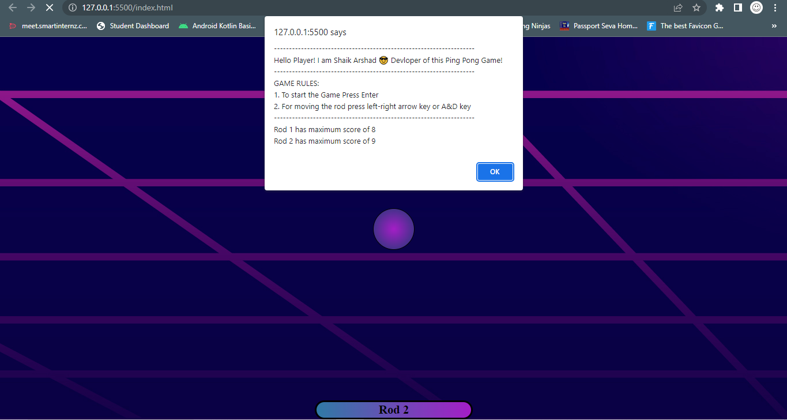

# PING-PONG GAME
In this project I used the most of the  JavaScript concepts and As well as HTML,CSS along with it  to make the game.

<h3> Live Game in the following link: https://arshu200.github.io/Ping-Pong-Game/ </h3>

# The Game instruction page:

 The Game instructions will show in the windows pop message only for the navigation of Rods1 and Rod2 with the 'A' for the Left side & 'D' for the Right side. And also shows the last game height scores as well after atleast one game.

# The Game page:

The Game page lokks like as shown in the figure.

# The Game End Page:

 When the Game Ends then the windows pop message as the Game scores of both Rod1 and Rod2 with the highest score.

# The Game Looks like:
[Ping Pong Game.webm](https://github.com/Arshu200/Ping-Pong-Game/assets/91214096/ebd2292d-3a80-41eb-add8-4c92f2cfb23d)

# Note :
For the icons I  used this following website https://favicon.io/ 
